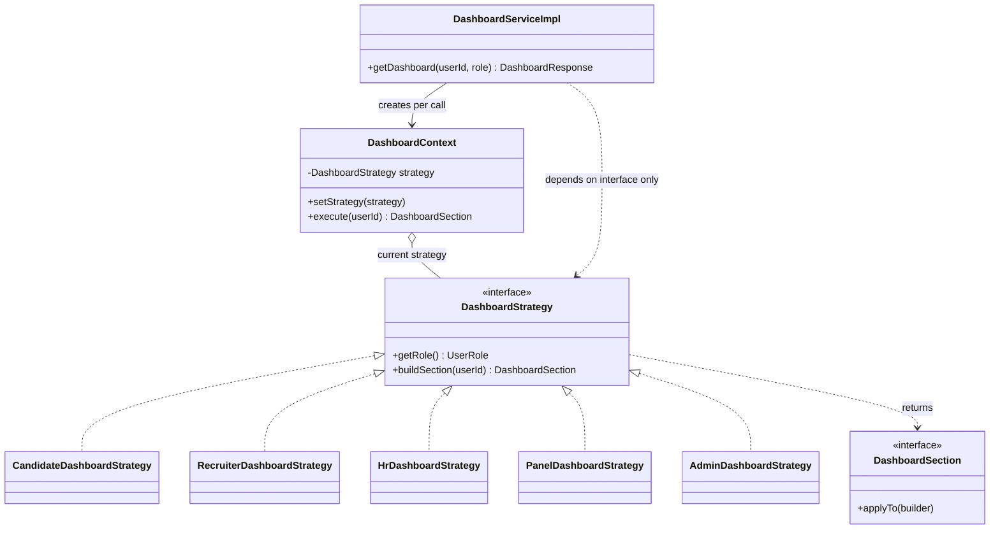
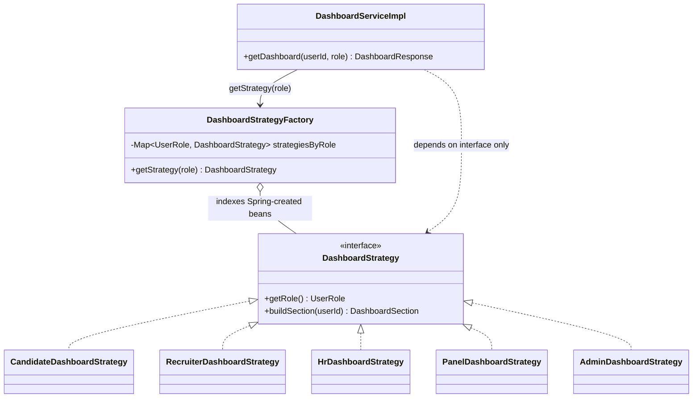

# Design Patterns — Dashboard Module

Two patterns are implemented in `backend/src/main/java/com/recruitsystem/dashboard`:
**Strategy** (behavioral) and **Factory** (creational). Both replace a single
`switch` on `UserRole` that used to live in `DashboardServiceImpl`.

---

## 1. Strategy Pattern

**Classification:** Behavioral

### Problem

`DashboardServiceImpl.getDashboard(userId, role)` built the whole dashboard
response in one method, with a `switch (role)` choosing which role-specific
block of logic to run (candidate applications, recruiter vacancy counts, HR
counts, panel interviews, admin totals). Every new role meant editing that
switch and growing an already-large class, violating the Open/Closed
Principle and making each role's logic hard to test in isolation.

### Solution

Each role's dashboard-building logic is extracted into its own class behind a
common interface, so the algorithms are interchangeable and selectable at
runtime without branching.

| Class | Role in the pattern |
|---|---|
| `DashboardStrategy` | Strategy interface — declares `getRole()` and `buildSection(Long userId)` |
| `CandidateDashboardStrategy` | Concrete Strategy — JOB_SEEKER |
| `RecruiterDashboardStrategy` | Concrete Strategy — RECRUITER |
| `HrDashboardStrategy` | Concrete Strategy — HR_EXECUTIVE |
| `PanelDashboardStrategy` | Concrete Strategy — INTERVIEW_PANEL_MEMBER |
| `AdminDashboardStrategy` | Concrete Strategy — SYSTEM_ADMINISTRATOR |
| `DashboardContext` | Context — holds the current strategy, exposes `setStrategy(...)` and `execute(userId)`, which delegates to it |
| `DashboardServiceImpl` | Client — gets a strategy (via the Factory, see below), puts it into a fresh `DashboardContext`, and calls `execute` |
| `DashboardSection` | Supporting interface — each strategy's result applies itself (`applyTo(builder)`) to the response builder, so the client never branches on result type either |

`DashboardContext` is deliberately **not** a Spring singleton bean: it carries
per-call mutable state (the active strategy), so `DashboardServiceImpl`
creates a new instance inside `getDashboard` for every request instead of
sharing one across concurrent users.

### Consequences

**Benefits**
- No `if/else` or `switch` on role remains in `DashboardServiceImpl`; adding a
  new role means adding a new strategy class, not editing existing code
  (Open/Closed Principle).
- Each role's logic is isolated in its own class with its own focused unit
  test (`CandidateDashboardStrategyTest`, etc.), instead of one large test
  class covering five unrelated code paths.
- Strategies are interchangeable at runtime on the same `DashboardContext`
  instance — demonstrated directly in `DashboardContextTest`.

**Costs**
- More files/classes to navigate than one method with a switch.
- The full set of role behaviors is no longer visible in a single place;
  understanding "what does the dashboard do" now means opening several
  classes.
- Something still has to map a `UserRole` to the right strategy instance —
  that responsibility is what the Factory below takes on.

### Class diagram

### Files in this repo

- `backend/src/main/java/com/recruitsystem/dashboard/strategy/DashboardStrategy.java`
- `backend/src/main/java/com/recruitsystem/dashboard/strategy/DashboardContext.java`
- `backend/src/main/java/com/recruitsystem/dashboard/strategy/CandidateDashboardStrategy.java`
- `backend/src/main/java/com/recruitsystem/dashboard/strategy/RecruiterDashboardStrategy.java`
- `backend/src/main/java/com/recruitsystem/dashboard/strategy/HrDashboardStrategy.java`
- `backend/src/main/java/com/recruitsystem/dashboard/strategy/PanelDashboardStrategy.java`
- `backend/src/main/java/com/recruitsystem/dashboard/strategy/AdminDashboardStrategy.java`
- `backend/src/main/java/com/recruitsystem/dashboard/dto/DashboardSection.java`
- `backend/src/main/java/com/recruitsystem/dashboard/service/DashboardServiceImpl.java`
- Tests: `backend/src/test/java/com/recruitsystem/dashboard/strategy/DashboardContextTest.java`,
  `CandidateDashboardStrategyTest.java`, `RecruiterDashboardStrategyTest.java`,
  `HrDashboardStrategyTest.java`, `PanelDashboardStrategyTest.java`,
  `AdminDashboardStrategyTest.java`

### 30-second demo explanation

"The dashboard used to pick what to show with one big switch on the user's
role. I pulled each role's logic into its own `DashboardStrategy`
implementation — one class per role — all behind the same interface. A
`DashboardContext` just holds whichever strategy it's given and calls it;
swap the strategy and the context's behavior changes immediately, which is
what this test here shows. The service no longer branches on role at all —
it just runs whatever strategy it's handed."

---

## 2. Factory Pattern

**Classification:** Creational

### Problem

Even after Strategy removed the role-based logic from `DashboardServiceImpl`,
something still has to decide *which* `DashboardStrategy` to run for a given
`UserRole`, and the client shouldn't need to know about every concrete
strategy class to do that — that would just move the coupling problem rather
than remove it.

### Solution

A dedicated factory hides strategy selection behind one method, so the client
depends only on the factory and the `DashboardStrategy` interface — never on
a concrete strategy class.

| Class | Role in the pattern |
|---|---|
| `DashboardStrategy` | Product interface (shared with Strategy, above) |
| `CandidateDashboardStrategy`, `RecruiterDashboardStrategy`, `HrDashboardStrategy`, `PanelDashboardStrategy`, `AdminDashboardStrategy` | Concrete Products |
| `DashboardStrategyFactory` | Factory — `getStrategy(UserRole role)` returns the matching strategy, or throws `IllegalArgumentException` for an unsupported role |
| `DashboardServiceImpl` | Client — calls `dashboardStrategyFactory.getStrategy(role)` and never references a concrete strategy class |

**Adaptation from the lecture's Vehicle example:** the lecture's factory
*instantiates* its concrete products directly (`new Car()`, `new Bike()`).
Here, each concrete strategy needs Spring-injected repositories/services
(e.g. `AdminDashboardStrategy` needs five repositories), so letting the
factory `new` them up itself would mean re-wiring all of Spring's dependency
graph by hand. Instead, `DashboardStrategyFactory` takes a
`List<DashboardStrategy>` constructor parameter — Spring creates and injects
every `@Component`-annotated strategy bean (with its dependencies already
resolved) — and the factory's only job is to index those already-built beans
into an `EnumMap<UserRole, DashboardStrategy>` and look one up by role. The
factory selects a Spring-created strategy bean rather than constructing one,
which is why its constructor has no `new StrategyX(...)` calls at all.

### Consequences

**Benefits**
- `DashboardServiceImpl` imports zero concrete strategy classes — only
  `DashboardStrategy`, `DashboardContext`, and `DashboardStrategyFactory`.
- One place validates the role and raises a clear error for an unsupported
  one, instead of that check being duplicated wherever a strategy is needed.
- Adding a new role is additive: write the new `@Component` strategy class
  and it's picked up automatically by the injected `List<DashboardStrategy>`
  — the factory needs no code change.

**Costs**
- Adds another layer of indirection on top of Strategy; a reader now follows
  `DashboardServiceImpl → DashboardStrategyFactory → DashboardStrategy` to
  find the actual logic.
- The factory's correctness depends on every role having exactly one
  strategy bean registered; a missing or duplicated `@Component` would only
  surface at runtime (a lookup miss, or Spring's bean map silently keeping
  the last one registered for that role).

### Class diagram

### Files in this repo

- `backend/src/main/java/com/recruitsystem/dashboard/strategy/DashboardStrategyFactory.java`
- `backend/src/main/java/com/recruitsystem/dashboard/strategy/DashboardStrategy.java` (shared with Strategy)
- `backend/src/main/java/com/recruitsystem/dashboard/service/DashboardServiceImpl.java` (shared with Strategy)
- Test: `backend/src/test/java/com/recruitsystem/dashboard/strategy/DashboardStrategyFactoryTest.java`
- Test: `backend/src/test/java/com/recruitsystem/dashboard/service/DashboardServiceImplTest.java`

### 30-second demo explanation

"Strategy gave me five interchangeable classes, but something still has to
pick the right one for a role. `DashboardStrategyFactory` does that — it
takes the list of strategy beans Spring already built, with their
repositories already injected, indexes them by role in an `EnumMap`, and
hands one back on `getStrategy(role)`. Unlike the classic factory that
constructs its own objects, this one just selects from objects Spring already
created, because the strategies need Spring-managed dependencies. The
service now only talks to the factory and the interface — it has no idea
`AdminDashboardStrategy` even exists."

---

## Why not Singleton?

A hand-written Singleton (private constructor, static `getInstance()`) was
not used anywhere here because Spring already does that job for every
`@Component`/`@Service` bean: by default, each bean (`DashboardServiceImpl`,
`DashboardStrategyFactory`, and every concrete `DashboardStrategy`) is
created once per application context and reused for every request. Writing a
manual Singleton on top of that would duplicate a guarantee the framework
already provides, add global static state that's harder to mock in tests,
and fight the constructor-injection style used throughout the rest of the
codebase for no benefit.
